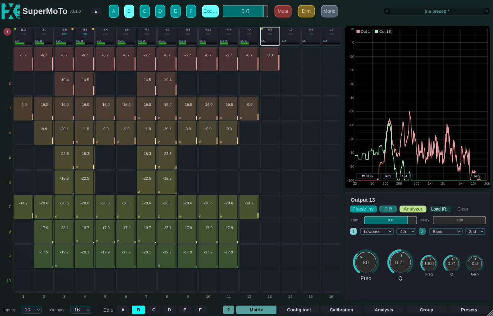
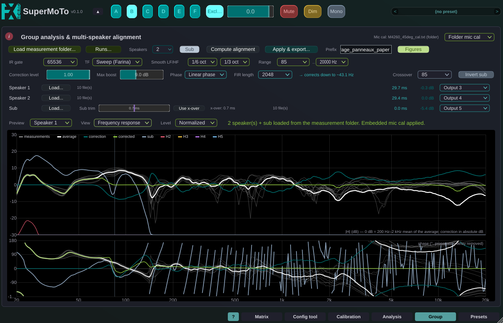
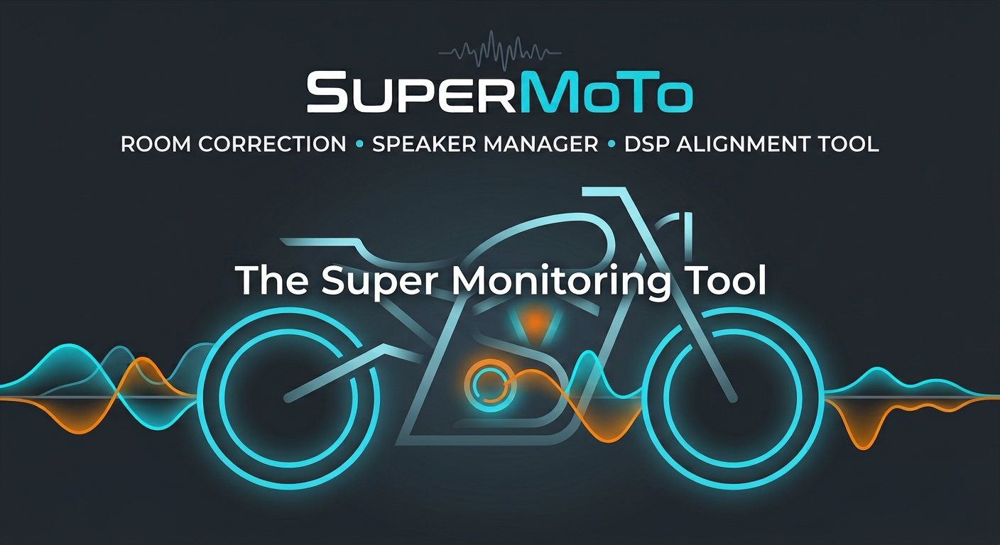

# SuperMoTo

**The Super Monitoring Tool**

SuperMoTo is an open-source audio plugin (VST3, AU and Standalone) that puts a
studio's monitoring signal chain into one plugin instance. It is the big
brother of [MoTo](https://github.com/odoare/MoTo).

From a single instance we can:

- route up to 32 inputs to 32 outputs (8 by default) through a full matrix,
  with per-crosspoint gain, 2-band EQ and polarity, and six configurations
  A..F switched or summed from the top bar;
- apply per-output trim, EQ, time-alignment delay and one FIR correction
  filter (zero-latency WDL convolution), with automatic inter-output latency
  compensation so speakers with filters of different lengths stay aligned;
- measure the loudspeakers in the room with built-in stimuli (sweep or
  band-limited noise), the raw speaker, the corrected one or the whole system;
- analyse those measurements and design the FIR correction curves (magnitude
  and phase), including phase-coherent subwoofer integration;
- align and correct a whole rig at once (several speakers plus a shared
  subwoofer) in the Group analysis mode;
- generate periphonic Ambisonics decoders up to third order, or import a
  decoding matrix exported by IEM's AllRADecoder.

## Documentation

Installation, building from source, the views and their controls, the measurement and correction workflow, the maths behind it can be found there:

- [doc/SuperMoTo.pdf](doc/SuperMoTo.pdf): the user manual.
- [doc/paper.pdf](doc/paper.pdf): the paper describing the monitoring chain,
  the latency budget, the subwoofer phase alignment and the group alignment.
- [doc/quickstart.pdf](doc/quickstart.pdf): a quickstart guide for anyone who wants to align a 2.1 monitoring system.

Every page of the plugin also has an info button **(i)** in its corner with a
summary of that page's controls and shortcuts, and there is a full tooltip implementation.

## License

AGPL-3.0-or-later, or commercial terms for holders of a commercial JUCE licence
— see [LICENSE.md](LICENSE.md) for the details and the framework-free parts
that stay LGPL-3.0-or-later (the Ambisonics decoding helper, the microphone
calibration script, the manual and the paper).

The shared FX-Mechanics code is not in this repository: it lives in
[FxmeTools](https://github.com/odoare/FxmeTools), whose framework-free `core/`
half is LGPL-3.0-or-later and can be used without JUCE.

---
Author: Olivier Doaré · FX-Mechanics · AGPL-3.0-or-later OR LicenseRef-FXME-Commercial

  

