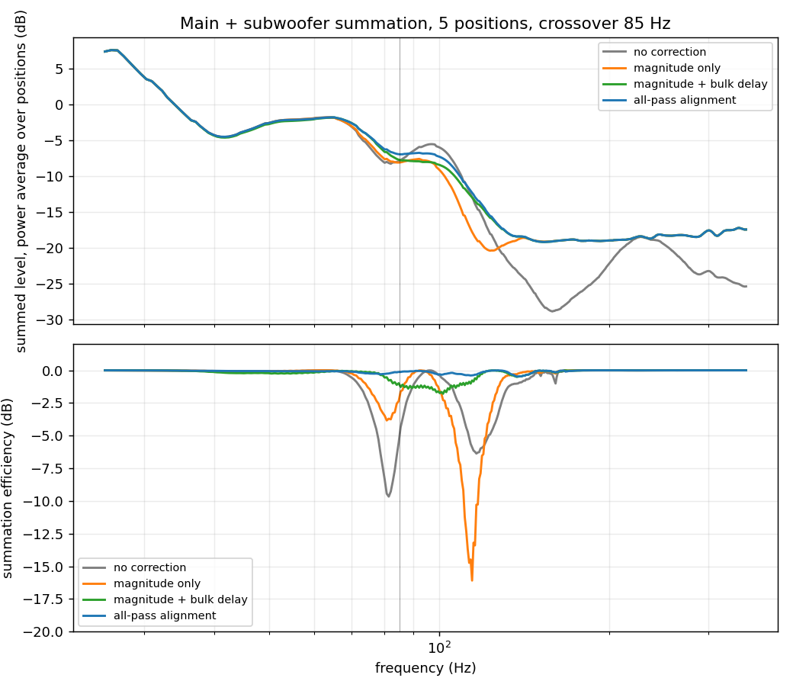

# Subwoofer alignment validation

Offline validation of the all-pass subwoofer phase alignment described in
`doc/chapters/app-analysis-theory.tex` (Section "Subwoofer phase alignment")
and in `doc/paper.tex`.

`sub_alignment_validation.py` re-implements the plugin's analysis chain in
numpy and uses it to predict the acoustic main-plus-subwoofer summation at
every microphone position, for several alignment strategies, from measurement
files the plugin itself wrote. It needs no plugin build and no new
measurements.

## Why the prediction is exact

Every subwoofer capture is delay-anchored on the main capture of the same
position, so the same propagation delay has been removed from both. The
acoustic sum at position *p* is therefore, up to that common factor,

    Y_p(f) = e^{-j 2 pi f T} HP(f) C(f) H_p(f)  ±  LP(f) S_p(f)

with *T* the main's delay relative to the subwoofer, HP and LP the
bass-management filters the configuration tool writes (4th-order Butterworth),
and C the designed correction. Nothing is simulated: H_p and S_p are the
measured responses, and the only modelled parts are the filters the plugin
would itself apply.

## Running it

On a measurement folder the plugin wrote, `--manifest` reads `measurement.xml`
for the channels, the subwoofer, the positions and the microphone calibration:

    python3 sub_alignment_validation.py --manifest \
        --data ~/Documents/supermoto/supermoto_paper6/Mirage_panneaux_paper \
        --crossover 80 --sub-gain -7.4 --analysis-low 40 \
        --smooth-lo 0.1667 --smooth-hi 0.3333 --max-boost 10

The design settings should match the group analysis that produced the
corrections (they are printed at the top of its report). `--sub-gain` is the
subwoofer's routing level relative to the mains as set in the matrix, which the
dry captures do not carry, and `--bm-crossover` the bass-management crossover
if it differs from the one the analysis was run at. `--no-mic-cal` drops the
calibration the plugin always applies; it is there to show what that costs, not
to be used.

Folders with ad-hoc file names are read instead with an explicit pattern:

    python3 sub_alignment_validation.py --data ~/supermoto_measurements \
        --prefix Mirage_14juin_ --mains L=1,R=2 --sub 3 --crossover 85 \
        --figure summation.png

The files are the plugin's own stereo captures (channel 1 the sent stimulus,
channel 2 the microphone). Needs numpy, scipy and, for `--figure`, matplotlib.

`make_paper_figure.py` builds the Validation figure of `doc/paper.tex` and
prints every number the paper's Section "Validation" quotes:

    python3 make_paper_figure.py --check-polarity \
        --positions "1=h1,4=h4,5=h5,6=h6,b6=6,b1=1" \
        --dry    ~/Documents/supermoto/supermoto_paper6/Mirage_panneaux_paper \
        --system ~/Documents/supermoto/supermoto_paper6

`--dry` is the folder the group analysis was run on; `--system` the folder
holding the three system runs and the two exports; everything else -- the
crossover, the analysis edge, the max boost, the FIR length and the delay each
main was given -- is read from the group report next to the exports, and
`--sub-gain fit` (the default) recovers the subwoofer's routing level from the
no-FIR run.

**`--positions` matters.** Without it the two sessions are paired by the
comment each run carries, which is right only while they name the positions the
same way. They have not always: `supermoto_paper6` calls "1" a point 8 cm above
the one the design session called "1" (and called "h1"), so pairing by name
puts four of the six shared positions in the wrong place, silently. The
campaign's geometry file is what settles it. The data confirms it: arrival
times fix the horizontal coordinate (neighbours are 15-30 cm and so tens of
samples apart) but cannot see 8 cm of height, which is a quarter of a sample;
the room response above 200 Hz can, and matching each system capture against
every dry candidate picks height and coordinate together.

## Following the plugin exactly

Five details of `AnalysisEngine` are easy to get wrong offline, and each moves
the scores by more than the effect being measured:

- **The average is not a complex average.** `computeAverage()` takes the
  magnitude from a power mean across the positions and only the phase from the
  complex mean, and `applySmoothing()` then smooths those two separately. A
  plain complex mean reads far below every curve that went into it wherever
  the positions stop agreeing on phase — 0.2 dB at 200 Hz but 12 dB at 13 kHz
  on the campaign-6 set — and a complex moving average over a 1/3-octave
  window puts that back even if the positions were averaged correctly. Mirrored
  here by `position_average()` and `smooth_average()`; use them instead of
  `smooth_var_octave(H.mean(axis=0), ...)`.

- **The microphone calibration is part of the design.** The plugin divides the
  mic response out of every spectrum before it inverts anything, so a chain
  that skips it designs a different filter. Applying it took the agreement with
  the plugin's own export from 1.5 dB RMS to 0.08 dB above 1 kHz.
- **The band-edge fade comes before the minimum-phase render.** `renderIR`
  takes the magnitude of the *finished* correction, fade included, and hands
  that to the cepstrum. Rendering first and fading afterwards changes the
  magnitude-only rows by about 0.7 dB, because the cepstrum spreads a change
  confined to the half-octave skirt over the phase of the whole band.
- **`--analysis-low` and `--smooth-hi` have to reach the code that uses them.**
  `band_weight` and `smooth_var_octave` took those settings as *default
  arguments*, which Python binds once at def time, so the command line rebound
  the module globals and nothing read them: every design was faded from 20 Hz
  and smoothed at 1/6 octave throughout. Fixed by reading the globals at call
  time. This one was worth 0.3-0.5 dB on the magnitude rows and turned the
  inverted-subwoofer row from -0.32 into -1.05 dB.
- **Compare like with like.** The plugin's export is a 2048-tap render; an
  unrendered frequency-domain design is not comparable to it below a few
  hundred hertz.

With all five right, the offline chain reproduces the plugin's exported filters
to **0.02-0.13 dB RMS in every band from 60 Hz to 8 kHz**, for both renderings
and both mains — measured before the averaging changed, against exports the
old engine wrote. Until the filters are exported again from the fixed engine,
that comparison is between two different designs and will read about 0.6 dB
RMS over 200 Hz - 10 kHz; that is the size of the fix, not an error.

## What it reports

Per main loudspeaker, for every strategy:

| column   | meaning |
|----------|---------|
| eff dB   | `20log10|M+S| - 20log10(|M|+|S|)`, weighted by the overlap of the two sources over [fx/2, 2fx]. 0 dB is perfectly in phase, negative is cancellation. |
| worst    | the same, at the worst of the microphone positions. |
| \|dphi\| | overlap-weighted RMS phase difference between main and subwoofer over the band. |
| ripple   | standard deviation of the summed level over the band. |
| notch    | worst single-frequency cancellation in the band. |
| max rot  | largest rotation the alignment factor A applies over 20-400 Hz. The phasor blend is bounded to 180 deg by construction; the unwrapped-angle ablation is not. |

Each table is printed twice. "design on all positions" designs the correction
from all the positions it is then scored on. "leave-one-position-out" designs
it from the other positions only, so the score is on data the filter never
saw.

The run also prints the crossover-band delay estimator (power-weighted and
plain) against the crossover setting, which is the stability claim of
`doc/chapters/app-delays.tex`.

Top: the summed level, power-averaged over the positions. Bottom: the
summation efficiency, where 0 dB is coherent addition. The grey curve is the
uncorrected system; the orange one a magnitude-only correction, which deepens
the crossover cancellation rather than curing it; the blue one is the all-pass
alignment, flat across the region.

## Result on the September 2026 design set (10 positions, main L)

Leave-one-position-out, so none of these numbers are fitted to what they are
scored on, at the settings `supermoto_paper6` was run with: crossover 80 Hz,
analysis from 40 Hz, subwoofer 7.4 dB below the mains. This is the set the
paper reports.

| strategy                        | eff dB | worst | \|dphi\| | notch  |
|---------------------------------|--------|-------|----------|--------|
| no correction, no alignment     | -0.89  | -1.44 | 74 deg   | -3.4   |
| magnitude only (min-phase)      | -1.21  | -1.72 | 81 deg   | -4.9   |
| mag + arrival-time delay        | -0.38  | -0.51 | 42 deg   | -1.6   |
| mag + crossover-band delay      | -0.63  | -1.10 | 53 deg   | -1.8   |
| **all-pass alignment**          | **-0.42** | **-1.06** | **39 deg** | **-1.1** |
| all-pass, subwoofer inverted    | -0.37  | -0.92 | 44 deg   | -1.7   |
| all-pass, no bulk delay         | -0.47  | -1.12 | 48 deg   | -1.4   |
| ablation: unwrapped-angle blend | -0.42  | -1.07 | 39 deg   | -1.1   |
| ablation: unwrapped, no delay   | -1.16  | -1.94 | 73 deg   | -4.9   |

Main R gives the same ordering within 0.05 dB.

Points the table makes:

- Correcting the main's magnitude alone makes the summation *worse* than no
  correction at all (-1.21 against -0.89 dB), because a minimum-phase
  magnitude correction moves the main's phase through the crossover region
  without regard for the subwoofer.
- **On the average the all-pass is not better than a magnitude correction with
  the arrival-time delay** here: -0.42 against -0.38, and each is the better of
  the two at five of the ten positions. What separates them is robustness, not
  the mean.
- It absorbs a subwoofer polarity inversion: -0.37 inverted against -0.42 the
  right way up, where a delay-only alignment falls to -6.14.
- It barely cares where the bulk delay comes from: dropping it altogether costs
  0.05 dB, while for a delay-only alignment the choice between the two
  estimators (0.7 ms apart here) is worth 0.25 dB.
- Leave-one-out changes nothing (-0.42 against -0.41 in-sample), so the
  subwoofer's phase through the crossover is a room-wide quantity rather than
  a per-position one.
- The phasor blend and a carefully anchored unwrapped-angle blend are
  equivalent once the bulk delay has been applied (-0.42 against -0.42). The
  phasor blend is far better without one (-0.47 against -1.16), and it needs no
  phase-unwrapping anchor at all, which is where its real advantage lies.

## Checked against the measured system (`supermoto_paper6`, 18 Sep 2026)

One analysis, exported twice two minutes apart, linear phase and minimum
phase, with nothing else touched: crossover 80 Hz, analysis from 40 Hz, 8192
taps. The system was then measured in "System" mode at eight positions in
three states, no FIR / linear / minimum, each state visited in turn at a
position before the microphone was moved. Six of the eight have a counterpart
in the design session.

- **The system applies the filter that was designed.** The ratio of a corrected
  run to the no-FIR run follows the exported filter to 0.28 dB RMS (left) and
  0.36 (right) over 200 Hz - 10 kHz for the minimum-phase export. The
  linear-phase one manages 0.56 and 0.64, and the gap is not in the filters:
  an 8192-tap linear-phase correction carries more bulk latency than the
  output's alignment delay, so that state bypasses the delay line while the
  other two run 1285 samples through it, and the two-tap interpolation those
  samples went through cost the treble about half a decibel. That is what sent
  us to `Source/Dsp/OutputProcessor.h`; the delay is now rounded to whole
  samples and the interpolation is gone.
- **The offline model is good to about 1 dB in the crossover region.**
  Predicting each of the six cases (three states, two mains) reproduces the
  measurement to 0.78-1.48 dB RMS over 35-250 Hz, and the crossover-band level
  to 0.32 dB, over the 5.5 dB that separates the uncorrected state from the
  corrected ones.
- **The alignment is measured, and it agrees with the model.** At 8192 taps the
  two exports share their magnitude to 0.06 dB RMS over 80-200 Hz and 0.01 dB
  above 200 Hz, so only their phase differs. The aligned one carries **+0.78 dB**
  (left) and **+0.88 dB** (right) more level through [fx/sqrt2, fx*sqrt2], at 8
  of 8 positions on both mains, from +0.53 to +1.40 dB. The model, given the
  same two filters, predicts +0.68 and +0.73 -- agreement within 0.15 dB on a
  quantity neither was fitted to.
- **Latency self-absorption works in the regime that stresses it.** The
  linear-phase filter's 4098 samples of bulk latency exceed the 1285 samples of
  alignment delay, so the compensation adds the remaining 2813 to every output:
  110.7-111.5 ms of system delay in that state against 46.7-47.5 ms in the
  other two, a difference of 64 ms against the 63.8 ms the arithmetic gives.
  The main-to-subwoofer offset is untouched.

Every number in this section compares a measurement against the filter that
was actually loaded when it was taken, so all of them survive the averaging
change of 21 Sep 2026. What does not survive is any comparison between one of
these measurements and a *re-derived* design: the `supermoto_paper6` filters
were exported by the previous averaging, and the current code designs about
1.8 dB more level through the crossover region. That is why
`doc/figures/fir-length.png` still shows the figure made before the change --
regenerating it needs the correction re-exported from the fixed engine and the
system measured again. Table 1 of the paper and panel (c) of
`validation.png` are pure offline comparisons and have been re-derived.

The earlier campaign at 2048 taps (`supermoto_paper4`) measured the same A/B at
+0.47 dB on both mains, but there the two renderings did *not* share a
magnitude (1.63 and 0.77 dB RMS across the crossover), so only about half of
that was the alignment. The 8192-tap repeat is the clean version.

## The analysis band edge

The correction is faded back to unity over a half-octave raised-cosine skirt
below the analysis low edge, and the alignment factor fades with it. An edge
set *at* the crossover therefore switches the phase steering off below
fx/sqrt2 -- inside the region the subwoofer dominates. The campaign ran with
the edge at 85 Hz, the crossover itself, and it shows:

| analysis low | all-pass | all-pass, sub inverted |
|--------------|----------|------------------------|
| 85 Hz        | -0.39    | **-1.05**              |
| 60 Hz        | -0.39    | -0.31                  |
| 40 Hz        | -0.38    | -0.32                  |

(at the 85 Hz crossover of the earlier campaign.) Moving the edge an octave
below the crossover restores the alignment's immunity to subwoofer polarity at
no cost to the aligned score, and it costs nothing else either, since the
correction down there is faded out in both cases. `supermoto_paper6` was run
that way -- crossover 80 Hz, analysis from 40 Hz -- and the immunity is there:
-0.34 dB inverted against -0.45 the right way up.
**Set the analysis range to start below the crossover, not at it.**

## What FIR length buys

The two phase renderings of one design only carry the same magnitude if the
filter is long enough to realise it. Rendering the campaign's own design both
ways (this prediction reproduces the measured 2048-tap disagreement, 1.59 and
0.75 dB against 1.63 and 0.77 measured):

| taps  | \|linear\| - \|minimum\|, 85-200 Hz | linear vs its own designed magnitude |
|-------|-----------------------------------|--------------------------------------|
| 2048  | 1.59 / 0.75 dB RMS (peak 4.1)     | 1.88 / 1.56 dB RMS                   |
| 4096  | 0.45 / 0.29 (peak 1.6)            | 0.52 / 0.32                          |
| 8192  | 0.06 / 0.05                       | 0.07 / 0.05                          |
| 16384 | 0.01                              | 0.01                                 |

Left main / right main, computed before the 8192-tap campaign was run.
**It then predicted the campaign correctly**, which is the best thing that can
be said for it: `supermoto_paper6`'s two 8192-tap exports share their magnitude
to 0.06 and 0.04 dB RMS over 80-200 Hz, against the 0.06 and 0.05 predicted,
where the 2048 pair differed from itself by 1.63 and 0.77.

`make_paper_figure.py` also writes `doc/figures/fir-length.png`
(`--out-length`), which puts the same sweep through the summation model and
against the measured state. Measured at 8192, the run now follows the 8192 and
16384 renderings, which lie on each other, and parts company with the 2048 one
by 6 dB at 115 Hz on the left main -- a feature of that length, not of the
design. In band power the four lengths are within a few tenths of each other,
so what length buys is the shape, and the agreement between the two renderings,
not the level.

Two consequences. For the A/B, 4096 leaves a magnitude confound of the same
order as the phase effect being measured and 8192 does not, so a repeat that
wants to be a phase experiment needs 8192. For the plugin, a 2048-tap
linear-phase correction misses its own designed magnitude by about 1.9 dB RMS
across the crossover region, which is an argument for the 4096 default whenever
the analysis reaches that low.

The price is latency: a linear-phase filter of n taps carries n/2 samples of
bulk latency, and what the output's own alignment delay cannot absorb is added
to every output by the compensation of `MatrixEngine::recomputeLatencyComp`.
At 2048 taps and a 29 ms alignment delay it is free; at 4096 it adds 17 ms to
everything, at 8192, 64 ms -- and that last figure is measured, not estimated:
110.7-111.5 ms of system delay in the linear state against 46.7-47.5 ms in the
other two. Relative timing between outputs is preserved either way, so the
experiment stays valid.

## The subwoofer polarity

Each configuration routes into the subwoofer output through its own crosspoint,
and the analysis report states the polarity of that **output**, not of the
route into it. A polarity switch left set differently in one of the
configurations being compared inverts the subwoofer silently, and a half turn
at the crossover is worth several decibels, which swamps the effect being
measured. It happened twice in this campaign's earlier runs.

`make_paper_figure.py --check-polarity` fits each state's polarity against the
dry captures and prints it. On `supermoto_paper4` all six cases come out
normal at 0.90-0.95 dB RMS, where the opposite sign costs 2.7-5.7 dB. Before
running an A/B, check the crosspoints in the matrix and then check them again
in the data.
